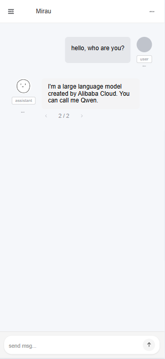
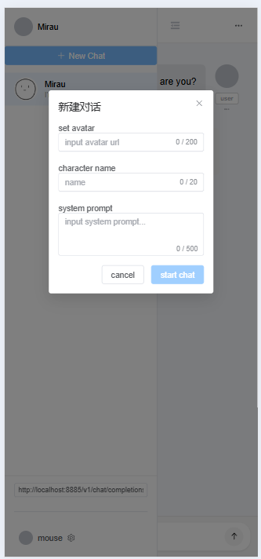
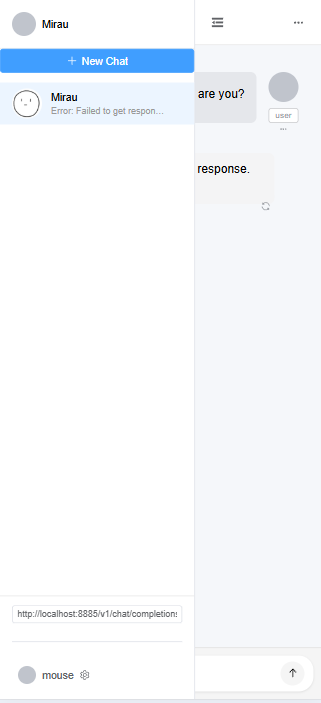
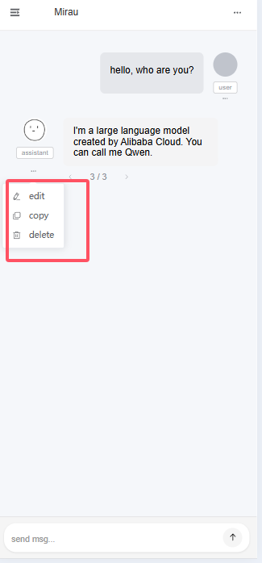
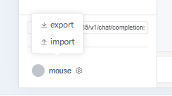
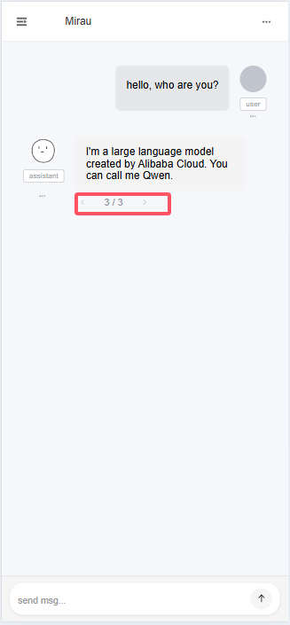

# mirau Chat UI

A CharacterAI-like chat interface developed with Claude, built using Vue 3.

## Screenshots

## Features

- 💬 Continuous conversations with chat history
- 🔄 Retry conversations while keeping previous messages
- 📝 Create multiple chat sessions
- 🤖 Compatible with all OpenAI API specification compliant endpoints
- 👤 Customize and edit character settings
- ✏️ Edit/Delete conversation messages (both assistant and user messages)
- 💾 Import/Export all configurations

## Tech Stack

- Vue 3
- TypeScript 
- Element Plus
- Yarn
